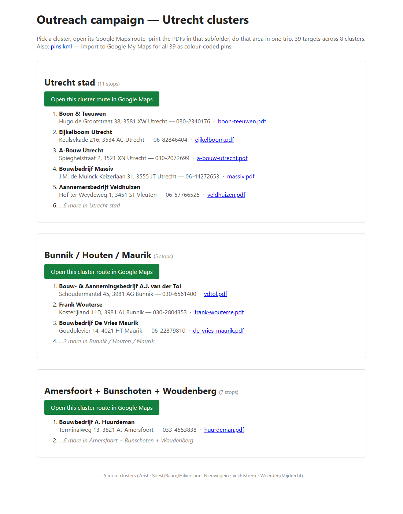

# inperson

A Claude Code skill that plans and runs a **physical / in-person cold-outreach** campaign for any B2B SaaS — walks you through targeting → per-target branded artefacts → a clustered driving route, then packages everything ready to print and drive.

```
/inperson
```

## What you get

Run the skill in any project, answer a handful of questions, and you end up with:

- **A list of 20–50 prospects** in your target region, researched from the web + any CSV / Notion / CRM you have.
- **One branded PDF per prospect** that looks like it came out of *their own* account on your SaaS — their logo, their colours, their company name on it. With a short "made by us, call X for a demo" CTA at the end.
- **Geographic clusters** — all prospects grouped into 5–10 driving areas so you do one neighbourhood per trip.
- **A clusters page** with one big "Open in Google Maps" button per cluster, plus links to print each prospect's PDF.
- **A Google My Maps KML** — import once, get all prospects as colour-coded pins, accessible from the Google Maps app on your phone.

Here's what the clusters page looks like:



Each green button opens a real driving route in Google Maps with all stops in that cluster pre-filled. Each `.pdf` link opens the branded artefact for that prospect, ready to print.

---

## Install

Pick the one that matches you.

### 👶 No-terminal install (easiest — for non-developers)

You just need to drop one folder into the right place on your computer. No commands.

1. **Download the skill.** On this GitHub page, click the green **`Code`** button (top right) → **`Download ZIP`**. Unzip wherever (usually goes to your Downloads folder).
2. **Open the Claude skills folder.**
   - **Windows**: open File Explorer, click the address bar, paste this, press Enter:
     ```
     %USERPROFILE%\.claude\skills
     ```
     (Creates the folder if it doesn't exist.)
   - **Mac**: in Finder press `Cmd + Shift + G`, paste this, press Enter:
     ```
     ~/.claude/skills
     ```
3. **Drag the `skills/inperson` folder** from the unzipped repo *into* the skills folder you just opened. (Only the `inperson` folder — not the whole repo.)
4. **Restart Claude Code** (close + reopen), or in a running session type `/reload-plugins`.
5. **Type `/inperson`** in any project — it'll walk you through the rest.

### ⚡ One-line install (any AI coding agent)

If you're comfortable opening a terminal, this installs it cross-agent (Claude Code, Cursor, GitHub Copilot, Codex, Gemini, Cline, and others), via [skills.sh](https://skills.sh):

```
npx skills add ammartaher/inperson-sales
```

### 🔧 Developer install (Claude Code plugin mode)

Load directly from this repo without installing — useful for testing the latest commit:

```
claude --plugin-dir https://github.com/ammartaher/inperson-sales
```

Then in your session: `/inperson-sales:inperson`.

---

## The five phases the skill walks you through

1. **Intake** — 10 quick questions: what your SaaS is, your ideal customer, your region, your phone number.
2. **Targets** — finds 20–50 prospects via web search + any CSV / Notion / CRM you provide.
3. **Customise** — finds your SaaS's per-customer template, builds a branding pack per target, writes a small script that rebrands and exports one artefact per prospect.
4. **Route** — groups prospects into driving clusters, builds Google Maps routes + a KML for Google My Maps.
5. **Package** — drops everything into `<your-project>/inperson/`, ready to print.

Full phase details live in the [skill files](skills/inperson/).

---

## Honest things to know

- **~15% of B2B sites** have logos that can't be auto-fetched (inline base64, white-only on transparent, behind a CDN with weird query params). The skill renders the artefact without a logo and flags those — it never blocks the run.
- **The skill writes to your SaaS's dev/internal tenant only.** It backs up the tenant's template before any write and restores it at the end. There's a safety check before it touches anything.
- **The salesperson CTA on the artefact is gated behind an opt-in template field**, so your *real* paying customers' artefacts never carry "made by us, call X" — only the ones generated by this skill do.
- **Google Maps "Reorder stops" is mobile-only** on the web UI. For clusters of more than 8 stops, the skill ships a path-format URL you can hit `Reorder` on in the Google Maps app.

---

## Origin

Distilled from a 9-day revenue sprint where a founder generated 39 per-target branded artefacts for prospects in one Dutch province, clustered them into 8 driving routes, and packaged everything for a Monday-morning blitz. The methodology turned out general enough for any B2B SaaS doing in-person cold outreach, so we extracted it into this skill.

## Author

Built by **[Ammar Taher](https://www.linkedin.com/in/amtaher)**. Reach out on LinkedIn if you adapt this for your SaaS or want to swap notes on physical outreach.

## License

MIT — see [LICENSE](LICENSE).
